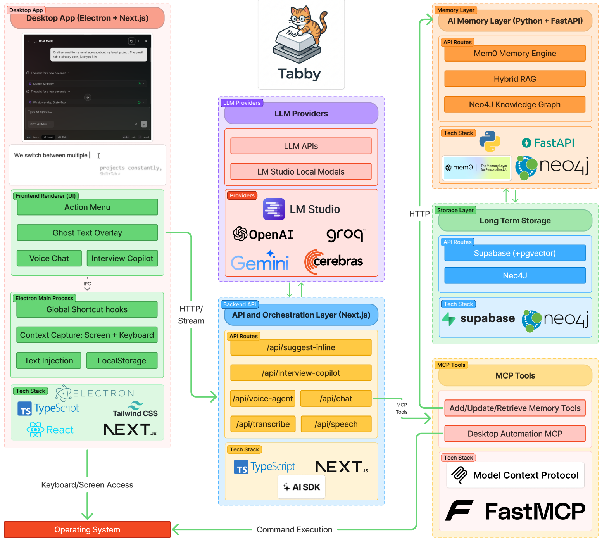

# Tabby - Architecture

This document describes the high-level architecture of Tabby, covering the major system layers, data flow between components, and the storage strategy.



---

## System Overview

Tabby is a **system-wide AI assistant** that runs as an Electron desktop app. It intercepts keyboard/screen activity, routes requests through an API orchestration layer to multiple LLM providers, and maintains a persistent memory layer for personalized responses.

The system is composed of four main layers:

| Layer | Tech | Purpose |
|---|---|---|
| Desktop App | Electron + Next.js + React | UI rendering, OS-level hooks, local storage |
| API Backend | Next.js (standalone) | LLM orchestration, streaming, tool routing |
| Memory Layer | Python + FastAPI + Mem0 | Persistent memory with vector search and knowledge graph |
| Storage | SQLite (local) + Supabase + Neo4j | Conversations, auth, memories, graph data |

---

## Layer 1: Desktop App (Electron + Next.js)

**Directory:** `frontend/`

The desktop app is an Electron shell embedding a Next.js frontend. It handles all OS-level interactions and renders the user interface.

### Electron Main Process (`frontend/electron/src/`)

The main process boots the app, creates windows, registers global shortcuts, and manages background services.

**Entry point:** `main.ts` - Creates the main window, system tray, initializes context capture, registers global shortcuts, and sets up IPC handlers. On first launch, opens the settings window for onboarding.

**App State (`app-state.ts`):** Centralized singleton holding references to all windows, services, and settings. Uses `electron-store` for persistence of user preferences (model selection, user ID, cached memories, onboarding status).

#### Windows (`windows/`)

Four Electron `BrowserWindow` types, each loading a different Next.js route:

| Window | Route | Purpose |
|---|---|---|
| Main | `/` | Action menu, chat, interview copilot |
| Settings | `/settings` | Model selection, API keys, preferences |
| Brain Panel | `/brain-panel` | Memory dashboard, knowledge graph viewer |
| Suggestion | `/suggestion` | Inline AI suggestion popup |

All windows are frameless, always-on-top, and transparent - designed to overlay on top of other applications without being intrusive.

#### Services (`services/`)

Background services running in the main process:

| Service | File | Purpose |
|---|---|---|
| Local Database | `local-db.ts` | SQLite via `better-sqlite3` for conversations and messages |
| File Storage | `local-file-storage.ts` | Local filesystem for screenshots and chat attachments |
| Text Handler | `text-handler.ts` | Clipboard operations, typewriter-mode text injection |
| Context Capture | `context-capture.ts` | Periodic screenshot capture for ambient awareness |
| Ghost Text Overlay | `ghost-overlay.ts` | Transparent overlay window for inline suggestions |
| Keyboard Monitor | `keyboard-monitor.ts` | Debounced keystroke buffer for auto-suggestions |
| Keystroke Listener | `keystroke-listener.ts` | Low-level keyboard hook for character capture |
| Interview Ghost | `interview-ghost.ts` | Code suggestion overlay for coding interviews |
| Caret Tracker | `caret-tracker.ts` | Tracks cursor position for overlay placement |
| Transcribe Service | `transcribe-service.ts` | Audio recording and transcription handling |
| Voice Agent Panel | `voice-agent-panel.ts` | Voice conversation panel management |
| Transcribe Indicator | `transcribe-indicator.ts` | Visual indicator for recording/processing state |

#### IPC Handlers (`ipc/`)

Bridge between the main process and renderer via Electron IPC. Handlers are grouped by domain:

- `db-handlers.ts` - Conversation and message CRUD (backed by local SQLite)
- `settings-handlers.ts` - Model, API key, and preference management
- `text-handlers.ts` - Text injection and clipboard operations
- `capture-handlers.ts` - Screen capture triggers
- `window-handlers.ts` - Window show/hide/resize
- `voice-agent-handlers.ts` - Voice agent panel toggle
- `transcribe-handlers.ts` - Transcription controls
- `onboarding-handlers.ts` - First-launch onboarding flow

#### Global Shortcuts (`shortcuts/`)

System-wide keyboard shortcuts registered via Electron's `globalShortcut` API. See the [README](../README.md) for the full shortcut reference.

#### Preload Script (`preload.ts`)

Uses `contextBridge.exposeInMainWorld` to safely expose IPC methods to the renderer process under `window.electron`. This is the security boundary between the sandboxed renderer and the privileged main process.

### Frontend Renderer (`frontend/src/`)

The renderer is a standard Next.js application rendered inside Electron.

#### Pages (`app/`)

| Route | Purpose |
|---|---|
| `/` | Main action menu - chat, copilot, quick actions |
| `/(auth)` | Sign-in / sign-up flows |
| `/dashboard` | Usage analytics and stats |
| `/brain-panel` | Memory viewer and knowledge graph |
| `/settings` | Preferences and configuration |
| `/suggestion` | Inline suggestion popup |
| `/ghost-overlay` | Transparent ghost text overlay |
| `/voice-agent-panel` | Voice conversation interface |
| `/transcribe-indicator` | Recording/processing status indicator |
| `/onboarding` | First-launch setup wizard |
| `/preferences` | User preferences |

#### Key Component Groups (`components/`)

| Group | Purpose |
|---|---|
| `action-menu/` | Main AI interaction surface - chat, copilot, action triggers |
| `brain-panel/` | Memory dashboard, graph visualization |
| `chat/` | Chat conversation UI and message rendering |
| `ai-elements/` | AI-specific UI components (message parts, code blocks, markdown) |
| `settings/` | Settings forms and controls |
| `supaauth/` | Supabase authentication components |
| `dashboard/` | Analytics charts and stats |
| `navigation/` | Tab bar, nav components |
| `ui/` | Shared design system (53 components) |

---

## Layer 2: API & Orchestration Backend (Next.js)

**Directory:** `nextjs-backend/`

A standalone Next.js application that serves as the AI orchestration layer. The frontend makes HTTP requests to these API routes; the Next.js backend handles prompt construction, LLM API calls (with streaming), and tool execution.

### API Routes (`src/app/api/`)

| Route | Method | Purpose |
|---|---|---|
| `/api/chat` | POST | General chat with streaming, memory retrieval, and tool use |
| `/api/suggest` | POST | AI suggestions for selected text (action menu) |
| `/api/suggest-inline` | POST | Inline autocomplete suggestions (ghost text) |
| `/api/completion` | POST | Text completion |
| `/api/interview-copilot` | POST | Multi-tab coding interview analysis (idea, code, walkthrough, tests) |
| `/api/interview-ghost-suggest` | POST | Code suggestion for interview ghost overlay |
| `/api/prep-mode` | POST | Interview preparation mode |
| `/api/voice-agent` | POST | Voice conversation with tool calling |
| `/api/voice-agent/execute-tool` | POST | Execute tools on behalf of voice agent |
| `/api/voice-command` | POST | Voice command interpretation |
| `/api/voice-generate` | POST | Generate voice responses |
| `/api/speech` | POST | Text-to-speech synthesis |
| `/api/transcribe` | POST | Audio-to-text transcription |
| `/api/search` | POST | Web search via Tavily |
| `/api/generate-title` | POST | Auto-generate conversation titles |
| `/api/download` | GET | File download handler |
| `/api/auth/signup` | POST | User registration |
| `/api/auth/verify-otp` | POST | OTP verification |
| `/api/dashboard/stats` | GET | Usage statistics |
| `/api/dashboard/analytics` | GET | Analytics data |

### LLM Providers

The backend uses the **Vercel AI SDK** to interface with multiple LLM providers through a unified API:

- **OpenAI** - GPT-4.1, GPT-4.1-mini, GPT-4.1-nano
- **Google Gemini** - Gemini models
- **Groq** - Fast inference
- **Cerebras** - Ultra-fast inference
- **OpenRouter** - Multi-provider routing
- **LM Studio** - Local model support

### MCP Tools

The backend supports **Model Context Protocol (MCP)** tools that extend LLM capabilities:

- **Memory tools** - Add, search, update, and retrieve user memories via the Python backend
- **Desktop Automation MCP** - System-level operations on Windows (via a separate `windows-mcp` server)

---

## Layer 3: Memory Layer (Python + FastAPI)

**Directory:** `backend/`

A Python FastAPI server providing the AI memory system powered by **Mem0**.

### How It Works

1. **Memory Extraction** - Mem0 automatically extracts key facts from conversations using an LLM (GPT-4.1-nano).
2. **Memory Classification** - An LLM-based classifier categorizes each memory into one of five types:
   - `LONG_TERM` - Persistent preferences and facts
   - `SHORT_TERM` - Temporary context
   - `EPISODIC` - Specific experiences and events
   - `SEMANTIC` - General knowledge and concepts
   - `PROCEDURAL` - How-to knowledge and workflows
3. **Vector Storage** - Memories are embedded and stored in Supabase (pgvector) for semantic search.
4. **Knowledge Graph** - Optionally, memories are also stored in Neo4j for relationship-based retrieval (Hybrid RAG).

### API Endpoints

| Endpoint | Method | Purpose |
|---|---|---|
| `/add` | POST | Extract and store memories from conversation messages |
| `/search` | POST | Semantic search across memories |
| `/get-all` | POST | Retrieve all memories for a user (optionally filtered by type) |
| `/add-image` | POST | Add memory from an image (visual memory) |
| `/memory/{id}` | GET | Get a specific memory |
| `/memory/update` | PUT | Update a memory |
| `/memory/{id}` | DELETE | Delete a memory |
| `/memory/user/{id}` | DELETE | Delete all memories for a user |
| `/memory/{id}/history` | GET | Get the history/changelog of a memory |

---

## Layer 4: Storage

Tabby uses a split storage strategy - conversations stay on-device, while memories and auth live in Supabase.

### Local Storage (On-Device)

| Store | Technology | Data |
|---|---|---|
| Conversations DB | SQLite (`better-sqlite3`) | Conversations and messages (chat, copilot, etc.) |
| Attachments | Local filesystem | Screenshots, chat file attachments |
| User Preferences | `electron-store` | Model settings, API keys, UI preferences |

The SQLite database lives at `{userData}/tabby.db` with WAL mode enabled. Conversations and messages are fully local - they never leave the device.

### Supabase (Cloud / Local Docker)

| Purpose | How |
|---|---|
| Authentication | User sign-up, OTP verification |
| Memory Vector Store | pgvector extension for semantic memory search |
| Storage Buckets | `context-captures` and `project-assets` for media files |

In development, Supabase runs locally via Docker. In production, it can point to Supabase Cloud.

### Neo4j (Optional)

Used for the **knowledge graph** portion of the memory system. Stores relationships between memories for Hybrid RAG (vector + graph retrieval). Optional - the system works without it, falling back to vector-only search.

---

## Data Flow

### Chat Flow

```
User types in Action Menu
    |
    v
Frontend (Next.js renderer)
    |  HTTP POST /api/chat
    v
Next.js Backend
    |-- Fetches relevant memories from Memory API (/search)
    |-- Constructs prompt with context + memories
    |-- Calls LLM provider (streaming)
    |-- Returns streamed response
    v
Frontend renders response
    |
    |  IPC: save to local DB
    v
Electron Main Process
    |-- Saves conversation + messages to SQLite
    |-- Stores new memories via Memory API (/add)
```

### Ghost Text (Inline Suggestion) Flow

```
User types in any application
    |
    v
Keystroke Listener (low-level keyboard hook)
    |
    v
Keyboard Monitor (debounced buffer)
    |  HTTP POST /api/suggest-inline
    v
Next.js Backend
    |-- Includes cached memories for context
    |-- Calls fast LLM (GPT-4.1-mini)
    |-- Returns suggestion
    v
Ghost Text Overlay (transparent window)
    |  Shift+Tab to accept
    v
Text Handler → injects text into active application
```

### Interview Copilot Flow

```
User presses Alt+X
    |
    v
Electron captures screen (screenshot)
    |  HTTP POST /api/interview-copilot
    v
Next.js Backend
    |-- Analyzes screenshot (vision model)
    |-- Generates multi-tab response:
    |   - Idea (problem breakdown)
    |   - Code (implementation)
    |   - Walkthrough (explanation)
    |   - Test Cases (edge cases)
    v
Frontend renders in tabbed UI
```

### Voice Agent Flow

```
User presses Ctrl+Alt+J
    |
    v
Voice Agent Panel opens
    |  Audio recording
    v
Transcribe Service → POST /api/transcribe
    |
    v
POST /api/voice-agent (with tools)
    |-- LLM processes with tool calling
    |-- May execute: memory tools, desktop automation
    |-- POST /api/speech (response TTS)
    v
Audio playback + text display
```

---

See the [README](../README.md) for setup instructions.
